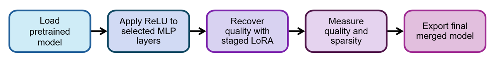

# ReLU-Tune

[](https://huggingface.co/bishmoy/Llama-3.1-8B-ReLU)

ReLU-Tune is a lightweight toolkit for fine-tuning and evaluating ReLU-activated language models. It provides a simple, config-driven workflow for full or partial ReLU-fication, staged LoRA training, model evaluation, and activation sparsity measurement.

## Overview

Modern gated language models do not naturally produce exact activation sparsity. Replacing transformer MLP activations with ReLU can create sparse activations, but naive full ReLU-fication can severely damage model quality. 

ReLU-Tune is built around that problem: apply ReLU, recover quality with LoRA fine-tuning, and measure the resulting tradeoff between capability and sparsity.



## Released Model

A public reference model produced with ReLU-Tune is available on Hugging Face:

- [`bishmoy/Llama-3.1-8B-ReLU`](https://huggingface.co/bishmoy/Llama-3.1-8B-ReLU)

This release is a full ReLU-fied Llama 3.1 8B model exported as a merged checkpoint for straightforward loading and evaluation.

## Quick Start

Install the required packages:

```bash
pip install -r requirements.txt
```

`requirements.txt` is intentionally broad. If you run into environment-specific issues, see `Tested Models and Environment` below for a known-good setup. `flash-attn` is optional.

Start a training run:

```bash
python scripts/train_staged_lora.py \
  --config configs/train_llama31_8b.yaml
```

Resume an interrupted run:

```bash
python scripts/resume_run.py \
  --run-dir runs/<your_run_name>
```

Evaluate the merged model:

```bash
python scripts/evaluate.py \
  --config configs/evaluation.yaml \
  --model-path runs/<your_run_name>/final_merged
```

Measure prefill activation sparsity:

```bash
python scripts/measure_sparsity.py \
  --config configs/sparsity.yaml \
  --model-path runs/<your_run_name>/final_merged
```

User-facing presets live at the top level of `configs/`.

## Configuration

Training and evaluation settings are defined through YAML configuration files. These include:

- Base model and tokenizer
- Training and validation data
- Layers targeted for ReLU-fication
- LoRA target modules and hyperparameters
- Number and size of training stages
- Checkpoint and evaluation intervals
- Downstream benchmark and perplexity settings
- Sparsity measurement settings

For partial ReLU-fication, the selected layers are defined directly in the training config. See `./configs` for sample setups.

## Staged LoRA Training

ReLU-Tune can divide training into multiple stages. At the end of each stage, the trained LoRA adapter is merged into the current model state and a new adapter is initialized for the next stage.

```text
stage 1: base model -> train LoRA 1 -> save adapter 1
stage 2: merge adapter 1 -> train LoRA 2 -> save adapter 2
...
stage n: merge adapters 1...n-1 -> train LoRA n -> export final model
```

This keeps intermediate artifacts smaller than repeatedly saving full dense checkpoints. If you want traditional single-stage LoRA training, you can configure the run to use a single stage.

## Evaluation

ReLU-Tune supports three types of evaluation:

1. Downstream benchmarks through LM Evaluation Harness
2. Perplexity on Wikitext-2 and a held-out RefinedWeb subset
3. Prefill activation sparsity on sampled text batches

The held-out RefinedWeb evaluation region is controlled in config through:

- `evaluation.refinedweb.skip_docs`
- `evaluation.refinedweb.num_samples`

## Reproducibility

The pipeline keeps the main experiment settings and runtime details explicit:

- RefinedWeb can be pinned to a specific revision in config
- Each run saves `config_snapshot.yaml`
- Runtime environment details are recorded in `run_metadata.json`
- Training progress is stored in `run_state.json` for resuming interrupted runs
- Prefill sparsity can be measured on a held-out subset
- Training, validation, and evaluation subsets are controlled through config fields

Resume support temporarily relaxes Transformers safe deserialization checks so local checkpoints can be loaded. Only resume checkpoints you trust.

## Training Artifacts

A typical run directory contains:

- `config_snapshot.yaml`: exact configuration used for the run
- `run_state.json`: staged training progress and resume metadata
- `run_metadata.json`: runtime environment details
- `stage_*/metrics.json`: training and validation metrics
- `stage_*/prefill_sparsity.json`: optional per-stage sparsity measurements
- `stage_*/adapter/`: LoRA adapter weights for each stage
- `final_merged/`: final merged dense model

Optional outputs include evaluation results and training plots.

## Scripts

- `scripts/train_staged_lora.py`: start a training run
- `scripts/resume_run.py`: resume an interrupted run
- `scripts/merge_stage_adapters.py`: recover and re-export a staged run
- `scripts/evaluate.py`: run benchmark and perplexity evaluation
- `scripts/measure_sparsity.py`: measure prefill activation sparsity
- `scripts/plot_run_metrics.py`: plot training and validation curves

## Repository Layout

```text
ReLU-Tune/
├── configs/          # Training and evaluation presets
├── graphics/         # README assets
├── scripts/          # User-facing entry points
├── src/              # Core implementation
├── requirements.txt
└── README.md
```

## Tested Models and Environment

- **Models:** Llama 3.x
- **Python:** `3.12.3`
- **PyTorch:** `2.8.0+cu128`
- **Transformers:** `5.12.1`
- **PEFT:** `0.19.1`
